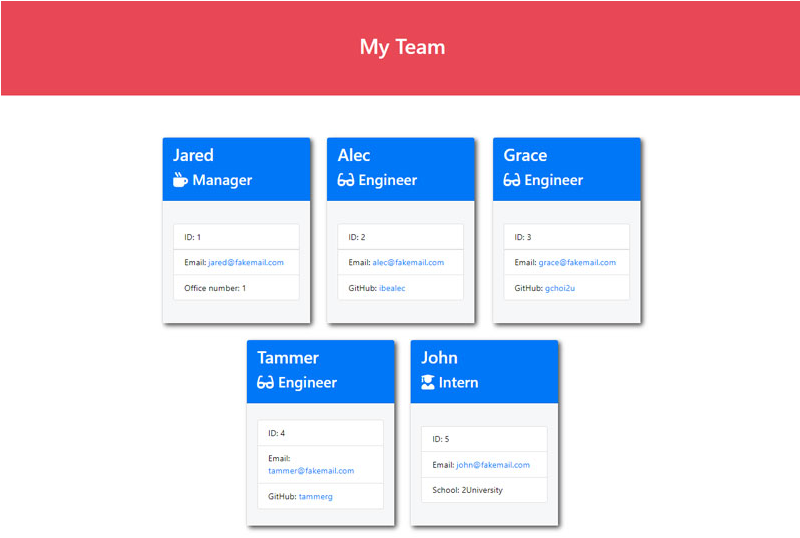
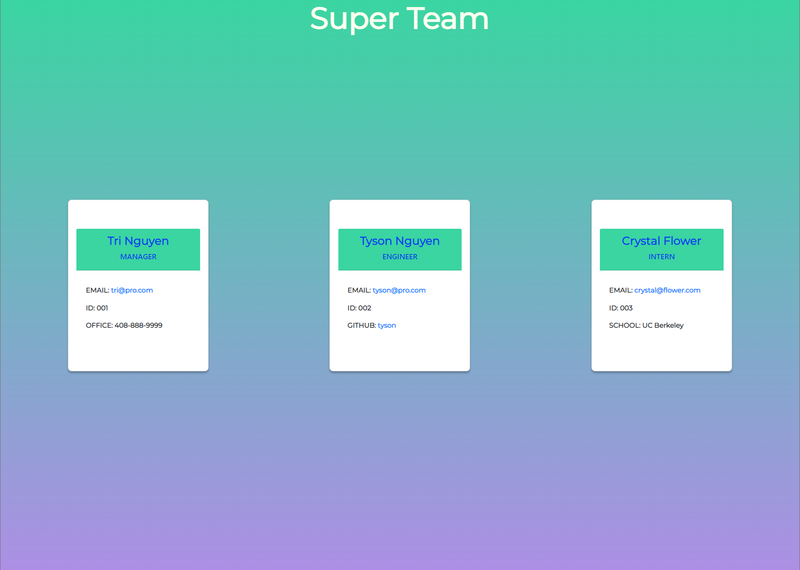
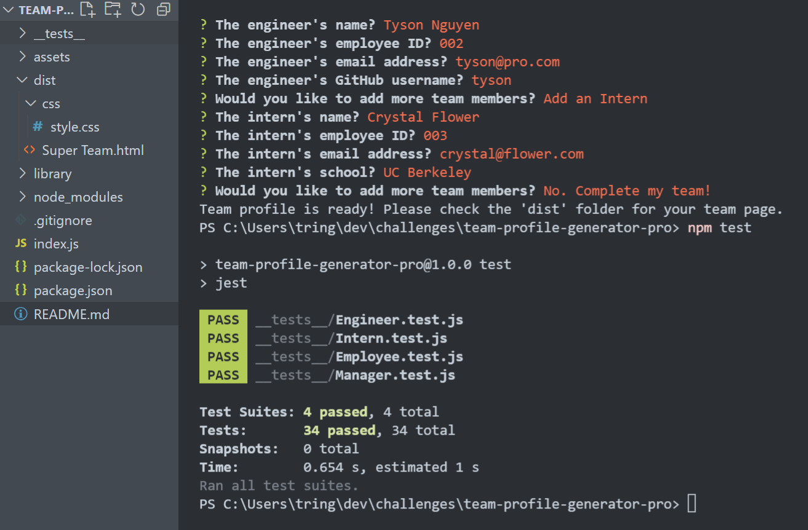

# Team Profile Generator

### Description

A command line application to dynamically create a webpage of key employee info (names, roles, contact info).

### Installation & Usage

* [x] Step 1: The following command is used to initiate the application at the root of your project:
```
node index.js
```
* [x] Step 2: Provide responses to all questions.

* [x] Step 3: Check your new website (*.html) output in the "dist" folder.

# Project Visuals

### Example from Challenge

* [x] 

### Example Output

* [x] 

* [x] Large file, so see here: [Video Demo of Page Generation](https://vimeo.com/661732314/8d99524285) or reference in teh assets file

* [x] 

* [x] 

### Built With

* [x] HTML
* [x] CSS
* [x] JavaScript
* [x] Node JS
* [x] Jest
* [x] Inquirer

# Task Performance

* [x] The user can run a command line application (using "node index.js) to create a team page including roles for Manager, Engineer, and Intern.
* [x] Employee profile information is built based on an inquirer question series.
* [x] The information is used to generated a dynamic webpage that features the above information as defined by user's inputs.
* [x] Information of a user's inputs, including email and github profile links, is made actionable - opening the website and/or the user default mail client.
* [x] Jest tests written to validate the employee definitions.

#### User Story

> AS A manager        
> I WANT to generate a webpage that displays my team's basic info        
> SO THAT I have quick access to their emails and GitHub profiles   

#### Acceptance Criteria

> GIVEN a command-line application that accepts user input        
> WHEN I am prompted for my team members and their information       
> THEN an HTML file is generated that displays a nicely formatted team roster based on user input       
> WHEN I click on an email address in the HTML       
> THEN my default email program opens and populates the TO field of the email with the address       
> WHEN I click on the GitHub username       
> THEN that GitHub profile opens in a new tab       
> WHEN I start the application       
> THEN I am prompted to enter the team manager’s name, employee ID, email address, and office number       
> WHEN I enter the team manager’s name, employee ID, email address, and office number       
> THEN I am presented with a menu with the option to add an engineer or an intern or to finish building my team       
> WHEN I select the engineer option       
> THEN I am prompted to enter the engineer’s name, ID, email, and GitHub username, and I am taken back to the menu       
> WHEN I select the intern option       
> THEN I am prompted to enter the intern’s name, ID, email, and school, and I am taken back to the menu       
> WHEN I decide to finish building my team       
> THEN I exit the application, and the HTML is generated             

## Acknowledgement & Resources

#### Additional Documents & Links

* [x] [Inquirer Package](https://www.npmjs.com/package/inquirer)
* [x] [Jest Documentation](https://jestjs.io/docs/getting-started)


